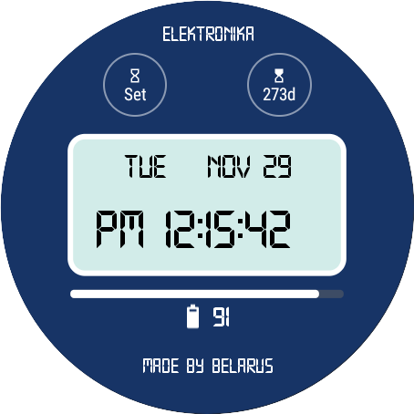

### Elektronika 
  Elektronika - it's a sample project that shows how to create watch face for [Android WearOS](https://developer.android.com/training/wearables/watch-faces/designing). 
Elektronika based on [Google WatchFace Sample](https://github.com/android/wear-os-samples/tree/main/WatchFaceKotlin), but was subject to a complete refactoring. This is a replica of an old [Soviet watch](http://www.netgrafik.ch/elektronika-watches.htm) - electronics, that might be uses on Android watch now)

================================================================================================

### Resources
* That project uses proprietary [typeface](https://www.creativefabrica.com/product/technology-family/ref/144265/). Licence purchased on a [creativefabrica](https://www.creativefabrica.com/referral-invite/YTJDRE5kWTJiNCs3YngvcVFjNUp6QT09OjpyyzvG1HC71iJVpWkw7XEb) platform according to the license number [******](xzpY-eaQt-SR9j-kzau )
* [Tinkoff ScrollingPagerIndicator](https://github.com/Tinkoff/ScrollingPagerIndicator)
* and [Android WearOS SDK](https://developer.android.com/training/wearables)