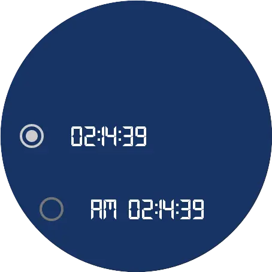

### Elektronika 
  Elektronika - it's a sample project that shows how to create watch face for [Android WearOS](https://developer.android.com/training/wearables/watch-faces/designing). 
Elektronika based on [Google WatchFace Sample](https://github.com/android/wear-os-samples/tree/main/WatchFaceKotlin), but was subject to a complete refactoring. This is a replica of an old [Soviet watch](http://www.netgrafik.ch/elektronika-watches.htm) - electronics, that might be uses on Android watch now)

---------------------------------------------------------------------------------

### Sample
Here you might found how is possible to create digital watch face 

  
  

With custom configuration menu:

  
  
  

And the ability to set it up with your phone:

  
  
  

---------------------------------------------------------------------------------

### Resources
* That project uses proprietary [typeface](https://www.creativefabrica.com/product/technology-family/ref/144265/). Licence purchased on a [creativefabrica](https://www.creativefabrica.com/referral-invite/YTJDRE5kWTJiNCs3YngvcVFjNUp6QT09OjpyyzvG1HC71iJVpWkw7XEb) platform according to the license number [******](xzpY-eaQt-SR9j-kzau )
* [Tinkoff ScrollingPagerIndicator](https://github.com/Tinkoff/ScrollingPagerIndicator)
* and [Android WearOS SDK](https://developer.android.com/training/wearables)

---------------------------------------------------------------------------------

### Donate
If you want to thank me or contribute to the development of the backlog, you may donate me. That helps me to concentrate more on the project.

You also might subscribe me on the next platforms to see any updates of my topics

